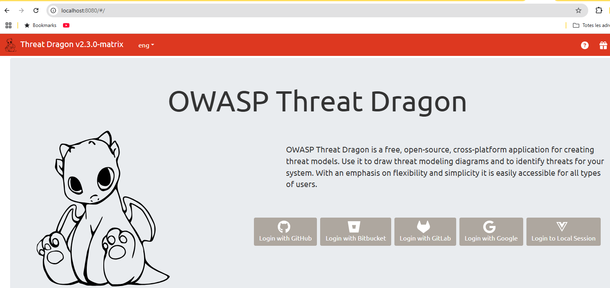
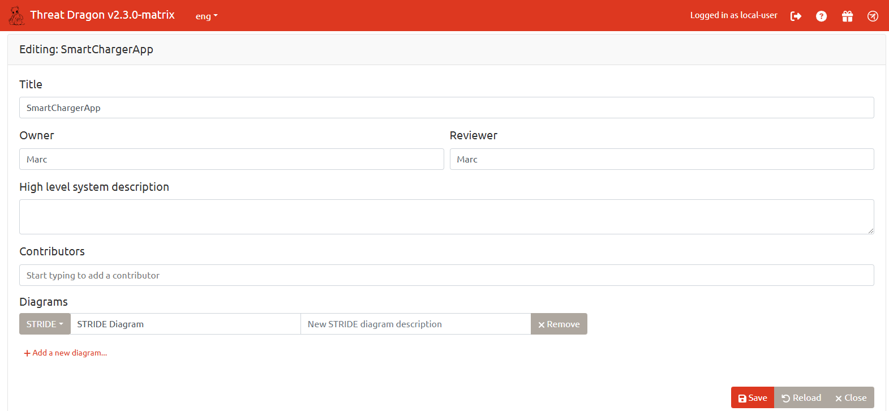
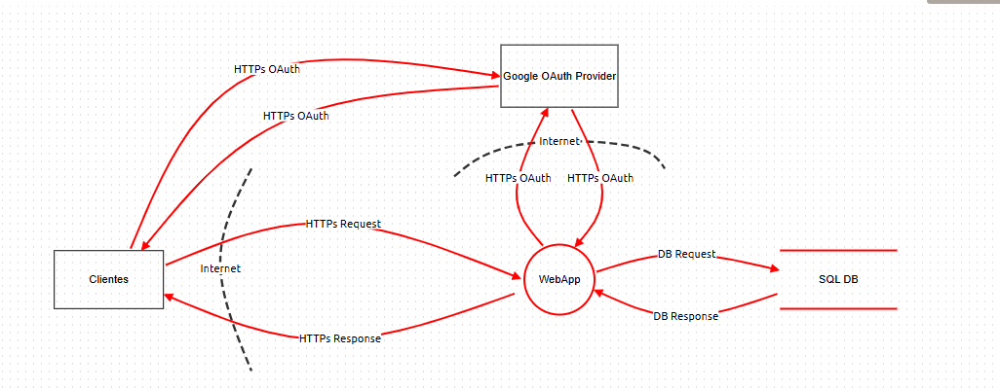

# Threat modeling (OWASP Dragon)

# Threat Modeling LAB

## Storyline

Trabajamos para una StartUp que se dedica al despliegue de cargadores para vehículos eléctricos en la ciudad. Para ello, está diseñando una aplicación web que permitirá a los usuarios acceder a un mapa con todos los puntos de recarga y activar el cargador de forma remota bajo demanda. 

A continuación se muestra un esquema del sistema propuesto


Nos han pedido hacer un análisis de amenazas `Threat Modeling` utilizando el modelo `STRIDE`. Para acotar el problema, nos centraremos en la interacción del usuario con el servicio web y el almacenamiento en una base de datos SQLServer. Tal y como se muestra a continuación


## Requisitos

Utilizaremos la herramienta [OWASP Threat Dragon](https://github.com/OWASP/threat-dragon). Para ello, utilizaremos Docker para desplegar la aplicación en local
- [Docker](https://docs.docker.com/)

## Lab

1- Desplegamos el Contenedor Docker, i exponemos la aplicación en el puerto `8080`

```bash
docker run -d --name threat-dragon -p 8080:3000 -v $(pwd)/.env:/app/.env ghcr.io/thematrix97/threat-dragon:v2.3.0
```
> Podéis revisar que la aplicación está en marcha con el comando `docker ps`

2- Accederemos a la herramienta utilizando nuestro navegador Web favorito `http://localhost:8080`.



> Para esta demo haremos login con una sesión en local (`Login to Local Session`).

3- Crearemos un nuevo modelo de amenazas, indicando el título de este junto al nombre del propietario



11- Genera un report completo del modelo que hemos dibujado y observa el informe generado. ¿Qué información incluye?


### Opcional

12- Queremos que nuestra aplicación permita a los usuarios hacer login con Google vía OAuth2.0 utilizando el flujo `Authorization Code Grant` y acceder a su información en la nube. Buscar información sobre este flujo e introduce los cambios necesarios en el modelo para incluir esta funcionalidad

<details>
<summary>Hint</summary>

A continuación se muestra una propuesta. Por una parte el cliente deberá acceder al proveedor para autorizar la aplicación, y por otra, la aplicación web tendrá que acceder al servicio para pedir el token y acceder a la información del usuario.



Revisa la rama `solution` para obtener el fichero .tm7 del modelo propuesto como solución.

</details>